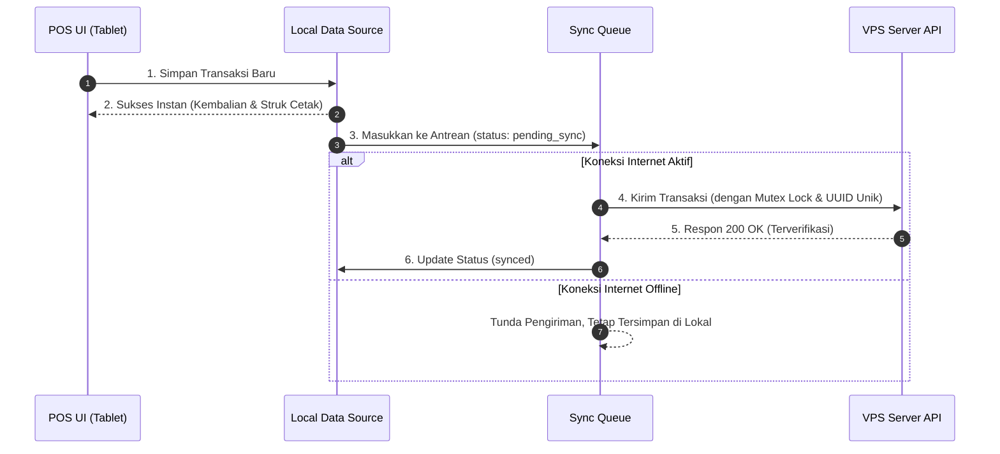

# DOKUMENTASI ARSITEKTUR SISTEM MRIS
**Multi-Restaurant Integration System (MRIS)**
*Dokumentasi Teknis Arsitektur Decoupled & Repository Pattern*

---

## 📖 1. Pendahuluan

Dokumen ini berisi panduan arsitektur teknis lengkap untuk proyek **MRIS (Multi-Restaurant Integration System)**. Sistem ini membagi operasional restoran menjadi dua aplikasi yang berdiri sendiri (*decoupled architecture*):
1. **Web Based Admin Standalone (`/web_admin`)**: Aplikasi manajemen pusat untuk Owner & Super Admin yang diakses via browser web.
2. **POS Mobile Tablet APK (`MRIS`)**: Aplikasi kasir Android khusus tablet yang dioptimasikan untuk transaksi kasir di lokasi cabang restoran.

---

## 🏛️ 2. Arsitektur Sistem Decoupled

```mermaid
graph TD
    subgraph Client Apps Layer
        WA["Web Based Admin (Web Browser)"]
        POS["POS Mobile Tablet (Android APK)"]
    end

    subgraph Design & Controller Layer (Repository Pattern)
        Ctrl["Controllers / Custom Hooks"]
        Service["Service Layer (Sync & Auth)"]
        Repo["App Repository Abstraction"]
    end

    subgraph Data Sources & Backend Layer
        LocalDS[("Local Data Source (IndexedDB / LocalStorage)")]
        RemoteDS["Remote Data Source (REST API)"]
        Backend[("Express.js / Node.js VPS Server")]
    end

    WA --> Ctrl
    POS --> Ctrl
    Ctrl --> Service
    Service --> Repo
    Repo --> LocalDS
    Repo --> RemoteDS
    RemoteDS --> Backend
```

### Keunggulan Arsitektur Decoupled:
- **Performa Ringan**: Proyek POS Mobile Tablet tidak lagi menanggung dependensi modul Admin, sehingga ukuran bundle JS mengecil dari **2.07 MB menjadi 642 KB** (3x lebih ringan) dan build time dipangkas menjadi **< 1 detik**.
- **Independensi Deployment**: Web Admin dapat di-deploy secara terpisah di Web Hosting / VPS (`mris-admin.barokahgroupindonesia.tech`), sementara POS Mobile Tablet dikompilasi menjadi APK Android Native via Capacitor.

---

## 🧱 3. Lapisan Arsitektur Repository Pattern

Arsitektur aplikasi dikelompokkan ke dalam 6 lapisan abstraksi yang terpisah dengan tegas (*separation of concerns*):

```text
src/
├── models/              # Lapisan Entitas Data & Model Skema
│   ├── Product.js       # Entitas Produk, Varian, & Harga Standar Outlet
│   └── Transaction.js   # Entitas Transaksi Penjualan
├── datasources/         # Lapisan Sumber Data
│   ├── LocalDataSource.js   # Pengelolaan persistent store IndexedDB / localStorage
│   └── RemoteDataSource.js  # Pengelolaan pemanggilan HTTP REST API ke VPS
├── repositories/        # Lapisan Abstraksi Repository
│   └── AppRepository.js     # Penggabungan Local + Remote, Caching, & Transaction Queue
├── services/            # Lapisan Logika Bisnis & Service
│   └── SyncService.js       # Background Sync Engine, Otentikasi, & Selisih Shift Closing
├── controllers/         # Lapisan React Controller Custom Hooks
│   └── usePosController.js  # Controller siap pakai untuk konsumsi komponen UI
└── components/
    └── mobile/          # Lapisan User Interface (UI Only)
```

---

## ⚡ 4. Alur Kerja Offline-First & Sync Engine



### Fitur Kunci Sync Engine:
1. **Idempotensi & Anti Double-Send**: Setiap transaksi memiliki UUID unik. Pengiriman transaksi dilengkapi kuncian mutex (`isSyncingLock`), menjamin **0 transaksi ganda (*zero duplicate send*)**.
2. **Crash-Safe Guarantee**: Status antrean disimpan di lokal database *sebelum* pengiriman HTTP request dilakukan. Jika tablet mati/aplikasi ditutup di tengah jalan, status pengiriman otomatis di-reset menjadi `pending_sync` saat aplikasi dibuka kembali.
3. **Bluetooth ESC/POS Thermal Printing**: Pencetakan struk tagihan, dapur, dan bar dilakukan secara langsung via Bluetooth Serial ke perangkat printer tanpa bergantung pada koneksi internet.

---

## 🔧 5. Panduan Maintenance & Build Pipeline

### 1. Membangun Aplikasi POS Mobile Tablet APK:
```bash
# Di direktori utama (/Users/argun/Documents/MRIS)
npm run build
npx cap sync android
cd android && ./gradlew assembleDebug
```
*Output File*: `MRIS_DualScreen_POS_Kasir.apk` (Lokasi: `android/app/build/outputs/apk/debug/app-debug.apk`)

### 2. Membangun Aplikasi Web Admin Standalone:
```bash
# Di direktori web_admin (/Users/argun/Documents/MRIS/web_admin)
cd web_admin
npm run build
```
*Output Bundle*: `web_admin/dist/`

### 3. Meng-update Server VPS Live:
Jalankan perintah ini di terminal SSH VPS (`mris-admin.barokahgroupindonesia.tech`):
```bash
cd /var/www/MRIS_TECH && git fetch origin && git reset --hard origin/main && npm run build && pm2 restart mris-app-tech
```
